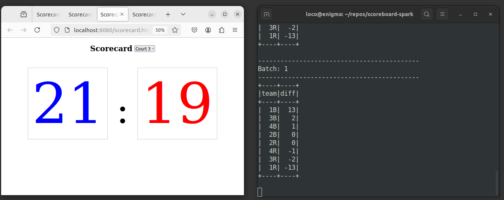

## Volleyball Tournament Scoreboard

### Project Overview
Volleyball tournament score collection and standings calculation in real-time.

---
### Solution Overview
Streaming **Scorecard** scores to _Kafka_ and consuming scores for **Scoreboard** visualization using _WebSockets_. Also consuming scores by _Spark Streaming_ for real-time **Standings**.

---
### Development Stack
- Scala and sbt (compiler and build tool)
- Apache Kafka Java Client library (producer and consumer apis)
- Akka-Http Scala library (Http and WebSocket server)
- Apache Spark Streaming (tournament standings)
- Apache Zeppelin Notebooks (further analysis of tournament) 
- D3.js (browser visualization)

---
### Solution - Score Collection
**Scorecard** data is collected from volleyball courts and posted on **Scoreboard**.

---
### Solution - Teams Standing
**Standings** are calculated in real-time as soon as the latest scores arrive.

---
### Code structure (Classes and Objects)

